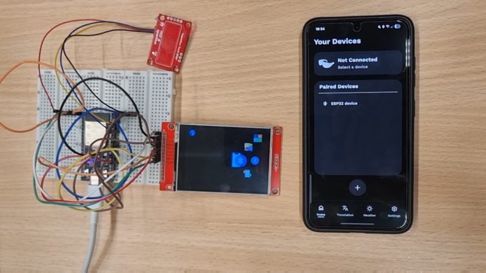

# Glassmate

## General info

**Team:**
- ### Alessio Ginolfi (https://github.com/1Alessio6) alessio.ginolfi@mail.polimi.it
- ### Matteo  Gatti (https://github.com/matti8702)  matteo.gatti7@mail.polimi.it
- ### Riccardo Cerberi (https://github.com/RiccardoCerberi) riccardo.cerberi@mail.polimi.it

## Table of Contents

1. [Project specifications](#project-specifications)

2. [Implemented features](#implemented-features)

3. [Build the project](#build-the-project)

4. [Demo](#demo)

5. [Credits](#credits)

## Project specification

This project involves the development of an Android application designed to communicate with an external device that emulates a pair of smart glasses. Communication between the two devices is established via the Bluetooth Low Energy (BLE) protocol.

The hardware simulation uses an ESP32 microcontroller, a capacitive touch sensor for detecting user gestures, and a display to emulate the lens. For more information, see [Setup the hardware](#setup-the-hardware).

Users can interact both through the Android app and the simulated smart glasses to control the ESP32’s interface. Typical actions include switching features or screens, selecting the forecast time to display, and viewing the latest notifications received from the Android device.

## Implemented features

| Feature                                   | State |
|-------------------------------------------|:-----:|
| Real-time Transcription/Translation       |  ✔️   |
| Weather forecast                          |  ✔️   |
| Notifications                             |  ✔️   |

**Legend:**
➖ Implementing
✔️ Implemented

### Real-time Transcription & Translation

The ESP32 displays text in real time from speech captured by the phone’s microphone. It can also show a translated version of the recognized text.

Users select a source language for speech recognition and, if needed, a target language for translation.

Each language requires a language pack installed on the phone. Language packs are managed from the Languages screen. Once a package is downloaded, it appears at the top of the list and is immediately available for transcription and translation.

### Weather Forecast

This feature provides both current conditions and future forecasts.

Users can choose to view current weather or forecasts at 3-hour intervals. Locations can be set manually (by entering a city) or automatically (via device location).

The app displays detailed information such as weather description (e.g. cloudy), temperature (average, high, low, feels-like), pressure, humidity, wind speed, and sunrise/sunset times.

The ESP32 receives essential forecast data (temperature, pressure, short description) for five time slots: the current one plus the next four.
Using the device’s touch sensor, users can scroll through time slots to view forecast data.

### Notifications

Users can view phone notifications directly on the glasses’ display.

When a notification arrives, an icon alert appears briefly (3 seconds). To see full details, users navigate to the Notifications page using the touch sensor.

In the app settings, users can choose which notifications are forwarded. If Do Not Disturb (DND) is enabled on the phone, no notifications are sent.

Notifications from WhatsApp, Telegram, Gmail, and Outlook are supported as well as phone calls and SMS.

## Build the project

### Prerequisites

To build the project the following software tools are needed

- [Android Studio][android-studio]

- [PlatformIO][platformio]

The hardware components used are

- [Espressif ESP32 Wroom](https://www.espressif.com/en/producttype/esp32-wroom-32)

- [SparkFun Capacitive Touch Sliders][sparkfun-touch-sliders]

- [Hailege 2.8 Inch ILI9341 240 x 320 TFT LCD Screen Display Touch Panel SPI Serial 3.3V](https://www.amazon.de/-/en/Hailege-ILI9341-Screen-Display-Raspberry/dp/B07YTWRZGR). In general, any display with 240 x 320 using the ILI9341 driver should work. 

### Clone the repository

Open the terminal and run the command

    git clone https://github.com/AleMatteRicky/DesignOfMobileApplication.git

this will clone the repository "DesignOfMobileApplication".

### Run the application

Make sure Android Studio is installed.

Open the IDE in the folder containing the project.

Click the Run icon.  

### Setup the hardware 

The following are the mappings used to attach the external device to the ESP32.

The mapping used to attach the TFT LCD's pins to the board is

| Pin      | TFT LCD
| -------- | ------ 
| MISO     | 12 
| MOSI     | 23
| SCLK     | 18
| CS       | 5
| DC       | 2
| RST      | 4

*NOTE* the library 'User\_Setup.h' has to be edited in order to reflect the pins layout. 

The capacitive touch sliders are connected as follows

| Pin      | TFT LCD
| -------- | ------ 
| GND      | black wire 
| 3.3      | red wire
| I2C SCL  | yellow wire
| I2C SDA  | blue wire

###  Upload code on ESP32

The guide will use the VSCode extension for PlatformioIO.

Make sure PlatformIO is installed.
Open VSCode in the project folder.
Click the Run icon. All dependencies are automatically handled by PlatformIO.

## Demo

Click the image below to view a demo of the full project in action.

## Credits

 * [Android Studio][android-studio]
 * [Espressif ESP32][espressif]
 * [Making Android BLE work](https://medium.com/@martijn.van.welie/making-android-ble-work-part-4-72a0b85cb442)
 * [BLE - espressif](https://docs.espressif.com/projects/esp-idf/en/stable/esp32/api-guides/ble/)
 * [State holders and UI state (Android)](https://developer.android.com/topic/architecture/ui-layer/stateholders)
 * [MVVM in Android](https://medium.com/@zorbeytorunoglu/mvvm-in-android-059e9aae84c1)
 * [Guide to app architecture (Android)](https://developer.android.com/topic/architecture)
 * [OpenWeather service](https://openweathermap.org/)
 * [SpeechRecognizer (Android)](https://developer.android.com/reference/android/speech/SpeechRecognizer)
 * [Weather icons made by iconixar from www.flaticon.com](https://www.flaticon.com/packs/weather-161)
 * [Pressure icons made by Good Ware from www.flaticon.com](https://www.flaticon.com/free-icon/gauge_4284060?related_id=4283902&origin=search)
 * [Wind icons made by kmg design from www.flaticon.com](https://www.flaticon.com/free-icon/wind_2529971?term=wind&page=3&position=43&origin=search&related_id=2529971)
 * [Selection arrow made by icon_small from www.flaticon.com](https://www.flaticon.com/free-icon/next_8050813?term=right+arrow&page=1&position=78&origin=search&related_id=8050813)
 * [Swipe arrow made by hqrloveq from www.flaticon.com](https://www.flaticon.com/free-icon/arrow_14025295?term=arrow&page=3&position=10&origin=search&related_id=14025295)
 * [Bluetooth Connection icon made by icon wind from www.flaticon.com](https://www.flaticon.com/free-icon/bluetooth_9173887?term=bluetooth&page=1&position=8&origin=search&related_id=9173887)
 * [Bluetooth Disconnection icon made by iconsmind from www.flaticon.com](https://www.flaticon.com/free-icon/bluetooth_16715663?term=bluetooth+disabled&page=1&position=8&origin=search&related_id=16715663)
 * [Chat icon made by Freepik from www.flaticon.com](https://www.flaticon.com/free-icon/chat_4187152?term=message&related_id=4187152)
 * [Translate icon made by Freepik from www.flaticon.com](https://www.flaticon.com/free-icon/translate_8121629?term=translate&related_id=8121629)
 * [Message notification icon madde by Freepik from www.flaticon.com](https://www.flaticon.com/free-icon/text_4457168?term=message+notification&page=1&position=1&origin=search&related_id=4457168)
 * [Call notification icon made by Moudesain from www.flaticon.com](https://www.flaticon.com/free-icon/phone_14991086?term=incoming+call&page=1&position=5&origin=search&related_id=14991086)

[android-studio]:https://developer.android.com/studio
[platformio]:https://platformio.org/
[espressif]:https://docs.espressif.com/projects/esp-idf/en/stable/esp32/index.html
[display]:https://www.amazon.de/-/en/Hailege-ILI9341-Screen-Display-Raspberry/dp/B07YTWRZGR
[sparkfun-touch-sliders]:https://www.sparkfun.com/sparkfun-capacitive-touch-slider-cap1203-qwiic.html